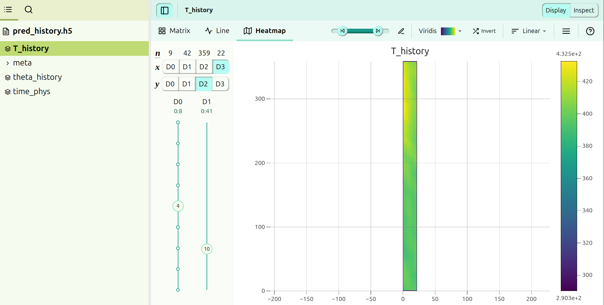

# heatsink_temperature_predict_3d

## eval
for evaluation:
### ckpt_120.pt
trained parameters
### heatsink_fno_model.py
evaluation network
### hs_input_conversion.py
transform input (csv file) into h5 file, which is readable by heatsink_fno_model.py
### pred_history.h5 
file processed by hs_input_conversion.py
### testcsv.csv
raw input

## model_param
parameters, same with the one in eval/ckpt_120.pt

## src
### eval_xxx.py
evlation files used in training
### train_xxx.py
training files used in training


## how to start
In the CLI, run
```
python hs_input_conversion.py
```
The file read testcsv.csv and calculates the predicted temperature in .h5 file.

The .h5 T_history group attributes are [time, height, width, length]. The illustration is shown below.




